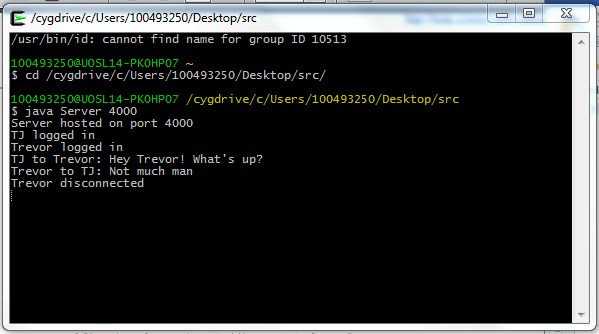
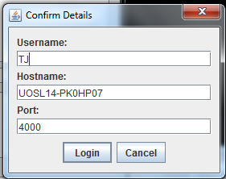
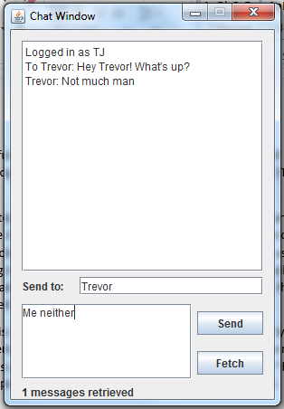

# Internet Chat Program
A Java application for text based communication over the Internet

## Design
The setup consists of a client application and a server application. The server is command line based. A new ServerThread object is created whenever a client logs in. The server processes text commands sent from the Client. The server outputs to the console as well as to `server.log`.

The Client uses a Java Swing based GUI. To log in, the user is presented with a dialog containing three text fields allowing the user to input their desired username, and the hostname and port of the server. Upon successfully logging in, the Client will store this information in a file called `login.cfg` for future instances.

## How to use
Both client and server can be run from the command line.
To run the server:

`java Server <port number>`

To run the client:

`java Client`

Typing `make run` will create an instance of a server and two clients.

The server will output to the console.

When the client starts up it will ask for a username and the hostname and port of the server. Usernames must contain only alphanumeric characters and underscores. If the dialog is cancelled, the client will terminate. Upon successfully logging in, the three data will be stored in a file so they can be remembered for future logins.

The main client window contains a text output pane and two input fields. The user must imput the username of the message recipient in the field labelled `Send to:`. A message can then be typed in the lower pane and sent using the `Send` button. Messages intended for the user can be retrieved using the `Fetch` button. The client will automatically log out when the window is closed.

## Future improvements
- Store mailbox of messages to save on RAM
- Add style formatting to text output box so that usernames appear in bold
- Have client continuously query the server for new messages instead of using a fetch button
- Add list of all users currently logged in to the server
